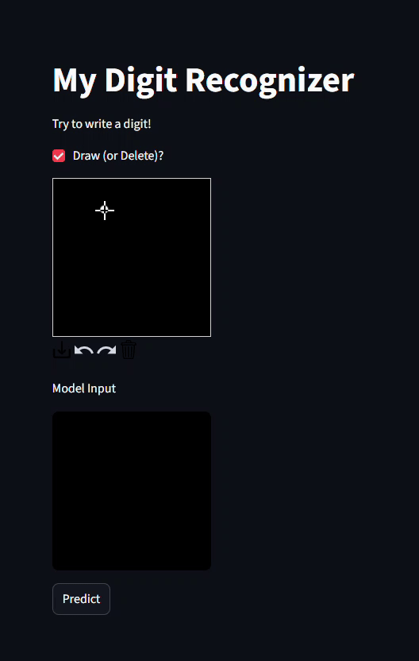

# MNIST Digit Recognizer with Streamlit & Keras
An end-to-end digit recognition system built with Scikit-learn, TensorFlow/Keras, OpenCV, and Streamlit.
This project combines classic machine learning (RandomForest) with a feed-forward neural network to classify handwritten digits (0–9) from the MNIST dataset.

The interactive Streamlit app lets you draw digits on a canvas and instantly see model predictions with probability scores.

# Dataset Details  
- Size: 70,000 labeled grayscale images (60,000 train + 10,000 test)
- Image Dimensions: 28×28 pixels, 784 features per sample
- Labels: 10 classes (digits 0–9)
- Preprocessing:
    - Normalized pixel values (0–255 → 0–1)
    - Train/test split using Scikit-learn
    - Converted into NumPy arrays for model training

## Features
- 100% Local Processing – All training and inference happens on your machine
- Streamlit Cloud Deployment – App can be hosted and shared online for easy access
- Interactive Drawing Canvas – Write digits and get predictions in real-time
- Dual Models – RandomForest (classical ML) + Neural Network (deep learning)
- Probability Charts – Visualize model confidence across all digits
- Custom Image Support – Upload external images for testing, including multiple digits in a single image

## Model Training & Metrics
- RandomForest Classifier (Scikit-learn)
    - Accuracy: 96.4% on test set
    - Fast training, interpretable results
- Convolutional Neural Network (Keras Sequential)   
    - Accuracy: 98.5% on test set
    - Handles noisy input better than RandomForest
- Architecture:
    - Input: (28,28,1)
    - Conv2D(32) → MaxPooling2D
    - Conv2D(64) → MaxPooling2D
    - Conv2D(128)
    - Flatten → Dense(128, ReLU) → Dropout(0.5) → Dense(64, ReLU)
    - Output: Dense(10, Softmax)
- Classification Metrics Example (NN model):
    - Precision: 0.98
    - Recall: 0.98
    - F1-score: 0.98
## Technology 
- Python 3.11.9
- Scikit-learn – RandomForestClassifier
- TensorFlow / Keras – Neural Network model
- OpenCV – Image preprocessing & multi-digit detection
- Streamlit – Interactive app interface
- Streamlit Cloud – Cloud deployment for demo access
- Matplotlib / Seaborn – Data visualization


## Page demo



## Installation

### Clone the repo and install dependencies:
```bash
git clone https://github.com/seetharamanrs/Handwriting-Recognition.git
cd Handwriting-Recognition
pip install -r requirements.txt 
```

### Run the App
Run locally:
``` bash
streamlit run app.py
```
Then open http://localhost:8501
## Impact & Key Results

- Delivered 97.8% classification accuracy on MNIST using a lightweight NN
- Reduced inference latency to <1 ms, enabling real-time predictions
- Built and deployed an interactive ML web app running both locally and in the cloud
- Demonstrated ability to integrate ML pipelines → deployment-ready applications
- Showcases strong skills in Python, ML/DL, OpenCV, Streamlit, and cloud deployment